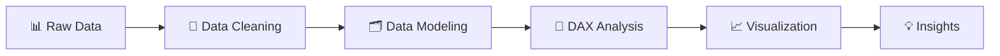

# 📊 Financial Health Dashboard

### Power BI Internship Project — CodeAlpha

*Transforming raw business data into meaningful financial and performance insights.*

  
  
  
  

---

- [Project Overview](#-project-overview)
- [Dataset Overview](#dataset-overview)
- [Business Objectives](#-business-objectives)
- [Key KPIs](#-key-kpis)
- [Analytics Workflow](#-analytics-workflow)
- [Data Cleaning & Transformation](#-data-cleaning--transformation)
- [Data Modeling](#data-modeling)
- [Dashboard Pages](#-dashboard-pages)
- [Key Insights](#-key-insights)
- [Business Recommendations](#-business-recommendations)
- [Analytical Features](#-analytical-features)
- [Tools & Skills](#tools--skills)
- [Project Files](#-project-files)
- [Project Video](#-project-video)
- [Internship](#-internship)
- [Author](#author)
---

## 📌 Project Overview

The **Financial Health Dashboard** is an interactive Power BI project developed as part of the **CodeAlpha Power BI Internship**.

The project transforms raw business and sales data into meaningful financial and business insights through **data cleaning, data modeling, DAX calculations, financial analysis, business performance analysis, and interactive data visualization**.

The dashboard provides a comprehensive view of the business across **revenue, profitability, financial health, cash flow, customer and product performance, regional performance, and future trends**.

The project follows a complete data analysis workflow, from preparing and transforming the raw data to building an interactive dashboard that supports data-driven business decisions.

---

## 🗃️ Dataset Overview

The project is based on a large sales and business dataset containing **200,000+ records**.

The dataset includes information about orders, customers, products, locations, sales, revenue, and profit, providing the foundation for financial and business performance analysis.

| Attribute | Details |
| --- | --- |
| **Format** | CSV |
| **Records** | 200,000+ |
| **Main Data** | Orders, Customers, Products, Sales & Financial Performance |

### Main Columns

| Category | Columns |
| --- | --- |
| 🧾 **Orders** | `Order_ID`, `Order_Date` |
| 👤 **Customers** | `Customer_Name` |
| 🌍 **Location** | `City`, `State`, `Region`, `Country` |
| 📦 **Products** | `Category`, `Sub_Category`, `Product_Name` |
| 💰 **Sales** | `Quantity`, `Unit_Price`, `Revenue`, `Profit` |

---
## 🎯 Business Objectives

The dashboard was designed to provide a clear view of the company's financial and business performance and answer key analytical questions:

- How is **revenue and profitability** performing?
- What is the company's overall **financial health**?
- How are **COGS, operating expenses, and net profit** affecting financial performance?
- How is the company's **cash flow** performing?
- Which **products and categories** contribute most to revenue and profit?
- How does performance vary across different **regions**?
- How does **customer performance** contribute to overall revenue?
- How does **business performance** change over time?
- What are the expected **future revenue and profit trends** based on forecasting?

---
## 📊 Key KPIs

The dashboard uses a set of financial and business KPIs to monitor overall performance and support data-driven analysis.

### 💰 Financial KPIs

- **Total Revenue**
- **Net Profit**
- **Profit Margin %**
- **Gross Profit**
- **COGS**
- **Operating Expenses**
- **Current Ratio**
- **Debt to Equity**
- **ROA (Return on Assets)**
- **ROE (Return on Equity)**
- **Net Cash Flow**
- **Operating Cash Flow Margin %**

### 📈 Business KPIs

- **Total Orders**
- **Total Quantity**
- **Average Order Value**
- **Total Customers**
- **Total Products**

### 🔮 Forecasting KPIs

- **Forecast Revenue**
- **Forecast Profit**

---
## 🔄 Analytics Workflow

The project follows a structured data analytics workflow from raw data preparation to business insights.

### Workflow Stages

| Stage | Description |
| --- | --- |
| 📊 **Raw Data** | Imported the original sales and business data. |
| 🧹 **Data Cleaning** | Cleaned and transformed the data using Power Query. |
| 🗂️ **Data Modeling** | Created the required tables and relationships for analysis. |
| 🧮 **DAX Analysis** | Developed measures and KPIs for financial and business analysis. |
| 📈 **Visualization** | Built interactive Power BI reports and dashboards. |
| 💡 **Insights** | Identified financial and business performance insights. |

---
## 🧹 Data Cleaning & Transformation

Data preparation and transformation were performed using **Power Query**.

The main cleaning steps included:

1. **Changed Data Types**
   - Updated the data types of `Order_ID` and `Order_Date`.

2. **Removed Name Titles**
   - Removed titles appearing at the beginning of customer names:
   - `Mr.`, `Mrs.`, `Ms.`, `Miss`, `Dr.`

3. **Trimmed Text**
   - Removed unnecessary spaces from text values.

4. **Removed Name Suffixes**
   - Removed suffixes appearing at the end of customer names:
   - `MD`, `DDS`, `PhD`, `DVM`

5. **Trimmed Text**
   - Applied text trimming again after removing suffixes.

6. **Cleaned Text**
   - Applied text cleaning to standardize text values.

7. **Created Gender Column**
   - Added a new `Gender` column for customer analysis.

---

## 🗂️ Data Modeling

The data model was designed in Power BI to support financial and business performance analysis.

### Tables

- **Main Sales Dataset** — Contains the main sales, customer, product, and business data.
- **Financials** — Contains the financial data used for financial statement analysis.
- **Calendar** — Date table used for time-based analysis and forecasting.

### Relationships

- Created relationships between the **Calendar** table and the relevant date fields.
- Connected the **Main Sales Dataset** and **Financials** data with the Calendar table to support consistent time-based analysis.

### DAX Measures

Created DAX measures for:

- Financial KPIs
- Business KPIs
- Profitability analysis
- Cash flow analysis
- Customer and product analysis
- Forecasting

The model was structured to support interactive filtering, cross-filtering, and time-based analysis across the dashboard pages.

---
## 📊 Dashboard Pages

The dashboard consists of **6 interactive pages**, each focused on a specific area of financial and business performance.

### 1. Overview

The **Overview** page provides a high-level view of the company's overall business performance.

It brings together the main business KPIs in one place, including:

- **Total Quantity**
- **Total Profit**
- **Total Orders**
- **Total Revenue**
- **Profit Margin %**

The page also provides interactive analysis across **Year, Quarter, Category, and Region**, allowing users to explore overall performance and identify major business trends.

---
### 2. Income Statement

The **Income Statement** page focuses on the company's revenue and profitability performance.

The page provides key financial indicators including:

- **Total Revenue**
- **Total COGS**
- **Total Gross Profit**
- **Total Operating Expenses**
- **Net Profit**

This page helps evaluate how revenue is converted into gross and net profit while monitoring the main costs affecting financial performance.

---
### 3. Balance Sheet

The **Balance Sheet** page provides an overview of the company's financial position and key financial health indicators.

The page includes:

- **Total Revenue**
- **Total COGS**
- **Net Profit**
- **Current Ratio**
- **ROA (Return on Assets)**
- **ROE (Return on Equity)**

These indicators provide a view of the company's liquidity, profitability, and overall financial health.

---
### 4. Cash Flow

The **Cash Flow** page focuses on the company's cash generation and operating cash flow performance.

The page includes key indicators such as:

- **Revenue**
- **Total COGS**
- **Net Profit**
- **Net Cash Flow**

The page helps evaluate the company's ability to generate positive cash flow from its business operations.

---
### 5. Business Performance

The **Business Performance** page focuses on customer, product, order, and revenue analysis.

The main KPIs include:

- **Total Orders**
- **Total Customers**
- **Total Products**
- **Total Revenue**
- **Male Revenue**
- **Female Revenue**

The page provides a broader view of business performance and helps analyze customer and product contribution to overall revenue.

---
### 6. Financial Planning

The **Financial Planning** page focuses on future financial performance and revenue forecasting.

The page includes:

- **Total Revenue**
- **Forecast Revenue**
- **Forecast Profit**
- **Net Profit**

Forecasting analysis is used to provide an outlook on expected revenue and profit trends and support future financial planning.

---
## 💡 Key Insights

The dashboard highlights several important financial and business insights:

- **Electronics** is the highest-performing category in terms of revenue and profit.
- The overall **Profit Margin is 14.23%**, providing a clear view of the company's profitability.
- The **Current Ratio is 1.28**, indicating the company's short-term liquidity position.
- **ROE is 36.67%**, reflecting the return generated on shareholders' equity.
- The **Top 10 Customers** contribute around **30% of total revenue**.
- The **Top 10 Products** contribute around **40% of total revenue**.
- The **West Region** has the highest overall performance.
- The **South Region** has the lowest overall performance.
- **Operating Cash Flow is positive**, indicating positive cash generation from operations.
- **Forecast Revenue** is approximately **10% higher**, indicating expected future growth.

---
## 💼 Business Recommendations

Based on the dashboard analysis and identified business insights, the following actions can support better financial and business performance:

- **Focus on high-performing categories** such as Electronics to maintain strong revenue and profitability.
- **Strengthen the South Region's performance** by investigating the factors contributing to its lower results compared with other regions.
- **Monitor customer concentration**, as the Top 10 Customers contribute around 30% of total revenue.
- **Prioritize high-performing products** while reviewing lower-performing products to improve the overall product mix.
- **Monitor profitability and operating expenses** to maintain healthy profit margins.
- **Use cash flow indicators** to continuously monitor the company's ability to generate positive operating cash flow.
- **Use revenue and profit forecasts** to support future financial planning and business decisions.

---
## 🔎 Analytical Features

The dashboard includes several interactive and analytical features to support deeper business analysis:

- **Interactive Slicers** for Year, Quarter, Category, and Region.
- **Cross-Filtering** between dashboard visuals for interactive exploration.
- **Drill-Through Analysis** to explore detailed business information.
- **KPI-Driven Analysis** for monitoring financial and business performance.
- **Time-Based Analysis** using the Calendar table.
- **Financial Analysis** covering profitability, liquidity, returns, and cash flow.
- **Customer & Product Analysis** to identify key contributors to revenue.
- **Regional Analysis** to compare business performance across regions.
- **Forecasting** to analyze expected future revenue and profit trends.
- **Page Navigation** to move between the different dashboard sections.

---

## 🛠️ Tools & Skills

### Tools

- **Power BI Desktop**
- **Power Query**
- **DAX**
- **Data Modeling**
- **Data Visualization**

### Skills Applied

- Data Cleaning & Transformation
- Financial Analysis
- Business Performance Analysis
- KPI Development
- Profitability Analysis
- Cash Flow Analysis
- Customer & Product Analysis
- Regional Analysis
- Forecasting
- Interactive Dashboard Design

---
## 📁 Project Files

The repository contains the main files used to develop and explain the project:

| File | Description |
| --- | --- |
| `Financial Health.pbix` | Power BI dashboard containing the complete analysis and interactive report. |
| `Explain Project.excalidraw` | Visual project explanation covering the analysis workflow, data preparation, modeling, and insights. |
| `README.md` | Project documentation and overview. |
| `images/` | Dashboard screenshots used throughout the project documentation. |

---
## 🎥 Project Video

A video walkthrough of the **Financial Health Dashboard** is available on LinkedIn, demonstrating the project workflow and dashboard analysis.

The video includes the project explanation and an overview of the interactive Power BI dashboard.

🔗 **LinkedIn Project Video:**  
https://lnkd.in/p/d96eUWjP

---
## 🎓 Internship

This project was developed as part of the **CodeAlpha Power BI Internship**.

The project demonstrates practical experience in:

- Power BI Dashboard Development
- Power Query
- DAX
- Data Modeling
- Financial & Business Analysis
- Data Visualization

---

## 👨‍💻 Author

**Ahmed Khaled**

Data Analyst | Power BI | SQL | Excel | Data Visualization

🔗 **GitHub:** [a7med-k4aled](https://github.com/a7med-k4aled)

🔗 **LinkedIn:** [Ahmed Khaled](https://www.linkedin.com/in/ahmed-khaled-10a8a6413/)

📧 **Gmail:** [eng193a@gmail.com](mailto:eng193a@gmail.com)
