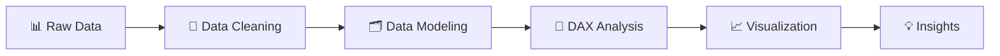

# 👥 Human Resources Analytics Dashboard

### Power BI Internship Project — CodeAlpha

*Transforming raw HR data into meaningful workforce and employee insights.*

  
  
  
  

---

- [Project Overview](#-project-overview)
- [Dataset Overview](#dataset-overview)
- [Business Objectives](#-business-objectives)
- [Key KPIs](#-key-kpis)
- [Analytics Workflow](#-analytics-workflow)
- [Data Cleaning & Transformation](#-data-cleaning--transformation)
- [Data Modeling](#data-modeling)
- [Dashboard Pages](#-dashboard-pages)
- [Key Insights](#-key-insights)
- [Business Recommendations](#-business-recommendations)
- [Analytical Features](#-analytical-features)
- [Tools & Skills](#tools--skills)
- [Project Files](#-project-files)
- [Project Video](#-project-video)
- [Internship](#-internship)
- [Author](#author)

---

## 📌 Project Overview

The **Human Resources Analytics Dashboard** is an interactive Power BI project developed as part of the **CodeAlpha Power BI Internship**.

The project transforms raw human resources data into meaningful workforce and employee insights through **data cleaning, data modeling, DAX calculations, recruitment analysis, employee turnover analysis, performance analysis, satisfaction analysis, engagement analysis, workforce forecasting, and interactive data visualization**.

The dashboard provides a comprehensive view of the organization across **employee status, recruitment, employee turnover, retention risk, employee performance, satisfaction, engagement, recruitment costs, and future workforce trends**.

The project follows a complete data analysis workflow, from preparing and transforming the raw HR data to building an interactive dashboard that supports data-driven workforce and HR decisions.

---

## 🗃️ Dataset Overview

The project is based on a human resources dataset containing employee-level information used for workforce, recruitment, turnover, performance, satisfaction, and engagement analysis.

The dataset includes information about employees, departments, employment status, salaries, recruitment activity, performance, satisfaction, engagement, and workforce-related metrics.

| Attribute | Details |
| --- | --- |
| **Format** | CSV |
| **Main Data** | Employees, Departments, Recruitment, Performance & Workforce Information |
| **Analysis Areas** | Workforce, Recruitment, Turnover, Performance, Satisfaction & Forecasting |

### Main Columns

| Category | Columns |
| --- | --- |
| 👤 **Employees** | Employee-related information |
| 🏢 **Department** | `Department` |
| 📌 **Employment Status** | `EmploymentStatus` |
| 💰 **Recruitment** | `RecruitmentCost` |
| 📈 **Performance** | Performance-related fields |
| 😊 **Satisfaction** | Satisfaction-related fields |
| 🤝 **Engagement** | Engagement-related fields |

### Employment Status

The `EmploymentStatus` column contains the following employee statuses:

- **Active**
- **On Leave**
- **Terminated**

---

## 🎯 Business Objectives

The dashboard was designed to provide a clear view of the organization's workforce and answer key HR analytical questions:

- How many **Total Employees** are in the organization?
- How many employees are currently **Active, On Leave, or Terminated**?
- What is the organization's overall **Turnover Rate**?
- What is the average employee **Salary**?
- What is the average employee **Satisfaction** level?
- How many **New Hires** are being added over time?
- What is the average **Time to Fill**?
- What is the average **Recruitment Cost**?
- Which employees are considered **High Retention Risk**?
- How does employee performance vary across the organization?
- What are the organization's average **Performance, Satisfaction, and Engagement** levels?
- What are the expected future **workforce and hiring trends** based on forecasting?

---

## 📊 Key KPIs

The dashboard uses a set of HR and workforce KPIs to monitor employee structure, recruitment, turnover, performance, satisfaction, engagement, and future workforce trends.

### 👥 Workforce KPIs

- **Total Employees**
- **Active Employees**
- **Terminated Employees**
- **Employees On Leave**
- **Average Salary**

### 💼 Recruitment KPIs

- **New Hires**
- **Average Time to Fill**
- **Average Recruitment Cost**

### 🔄 Employee Turnover KPIs

- **High Retention Risk**
- **Employees On Leave**
- **Terminated Employees**
- **Turnover Rate**

### 📈 Performance & Satisfaction KPIs

- **Average Salary**
- **Average Performance**
- **Average Satisfaction**
- **Average Engagement**

### 🔮 Workforce Forecasting KPIs

- **New Hires**
- **Average Recruitment Cost**
- **Average Time to Fill**

---

## 🔄 Analytics Workflow

The project follows a structured HR analytics workflow from raw data preparation to workforce insights.

---
### Workflow Stages

| Stage | Description |
| --- | --- |
| 📊 **Raw HR Data** | Imported the original human resources data. |
| 🧹 **Data Cleaning** | Cleaned and transformed the data using Power Query. |
| 🗂️ **Data Modeling** | Created the required tables and relationships for analysis. |
| 🧮 **DAX Analysis** | Developed measures and KPIs for HR and workforce analysis. |
| 📈 **Visualization** | Built interactive Power BI reports and dashboards. |
| 💡 **Insights** | Identified workforce, recruitment, turnover, performance, and satisfaction insights. |

---
## 🧹 Data Cleaning & Transformation

Data preparation and transformation were performed using **Power Query**.

The main cleaning steps included:

1. **Changed Data Types**
   - Updated the data types of the required columns.

2. **Trimmed Text**
   - Removed unnecessary spaces from text values.

3. **Cleaned Text**
   - Applied text cleaning to standardize text values.

4. **Handled Missing Values**
   - Reviewed and handled missing values where required.

5. **Standardized Categories**
   - Standardized categorical values such as `EmploymentStatus` and `Department`.

6. **Prepared Date Fields**
   - Prepared the relevant date fields for time-based HR analysis.

7. **Created Calendar Table**
   - Created a Calendar table to support time-based analysis and workforce forecasting.

---

## 🗂️ Data Modeling

The data model was designed in Power BI to support workforce, recruitment, turnover, performance, satisfaction, engagement, and forecasting analysis.

### Tables

- **HR Data** — Contains the employee and human resources information used throughout the dashboard.
- **Calendar** — Date table used for time-based analysis and workforce forecasting.
- **Measures** — Contains the DAX measures used across the dashboard.

### Relationships

- Created relationships between the **Calendar** table and the relevant date fields.
- Used the Calendar table to support consistent time-based analysis across the dashboard.

### DAX Measures

Created DAX measures for:

- Workforce KPIs
- Recruitment KPIs
- Employee turnover
- Retention risk
- Performance analysis
- Satisfaction analysis
- Engagement analysis
- Recruitment cost analysis
- Time to fill analysis
- Hiring analysis
- Workforce forecasting

The model was structured to support interactive filtering, cross-filtering, and time-based analysis across the dashboard pages.

---
## 📊 Dashboard Pages

The dashboard consists of **5 interactive pages**, each focused on a specific area of human resources analytics.

### 1. HR Overview

The **HR Overview** page provides a high-level view of the organization's workforce and employee status.

It brings together the main HR KPIs in one place, including:

- **Total Employees**
- **Terminated Employees**
- **Active Employees**
- **Average Salary**
- **Average Satisfaction**
- **Turnover Rate**

The page provides an overall snapshot of the organization's workforce and helps users understand the current employee situation.

---
### 2. Recruitment Analytics

The **Recruitment Analytics** page focuses on the organization's hiring activity and recruitment performance.

The page provides key recruitment indicators including:

- **New Hires**
- **Average Time to Fill**
- **Average Recruitment Cost**

This page helps analyze hiring activity and evaluate the time and cost associated with recruitment.

---
### 3. Employee Turnover

The **Employee Turnover** page focuses on employee retention and workforce changes.

The page includes:

- **High Retention Risk**
- **Employees On Leave**
- **Terminated Employees**
- **Turnover Rate**

This page helps monitor employee turnover and identify employees who may require additional attention from HR teams.

---
### 4. Performance & Satisfaction

The **Performance & Satisfaction** page focuses on employee performance, satisfaction, engagement, and compensation.

The main KPIs include:

- **Average Salary**
- **Average Performance**
- **Average Satisfaction**
- **Average Engagement**

The page provides a broader view of employee experience and workforce performance.

---
### 5. Workforce Forecast

The **Workforce Forecast** page focuses on future workforce and recruitment trends.

The page includes:

- **New Hires**
- **Average Recruitment Cost**
- **Average Time to Fill**

Forecasting analysis is used to provide an outlook on future hiring activity and recruitment-related trends and support workforce planning.

---
## 💡 Key Insights

The dashboard highlights several important HR and workforce insights:

- Provides a clear overview of **Total, Active, Terminated, and On Leave employees**.
- Monitors the organization's overall **Turnover Rate**.
- Tracks **New Hires** over time.
- Monitors the average **Time to Fill** for recruitment.
- Tracks the average **Recruitment Cost**.
- Identifies employees classified as **High Retention Risk**.
- Provides visibility into employee **Performance, Satisfaction, and Engagement**.
- Allows workforce information to be analyzed across different **Departments**.
- Provides insight into workforce trends over time.
- Uses historical hiring activity to support **Workforce Forecasting**.
- Provides a **6-month forecast** to support future hiring and workforce planning.

---
## 💼 Business Recommendations

Based on the dashboard analysis and identified HR insights, the following actions can support better workforce management:

- **Monitor employee turnover** regularly to identify workforce areas that may require further investigation.
- **Review high retention risk employees** and investigate the factors that may contribute to potential turnover.
- **Monitor recruitment performance** using New Hires, Average Time to Fill, and Average Recruitment Cost.
- **Review recruitment costs** to identify opportunities for improving hiring efficiency.
- **Monitor employee satisfaction and engagement** alongside performance indicators.
- **Analyze departmental workforce patterns** to understand differences in employee distribution and workforce status.
- **Use workforce forecasting** to support future hiring and recruitment planning.
- **Compare historical and forecast hiring activity** to better prepare for future workforce requirements.

---
## 🔎 Analytical Features

The dashboard includes several interactive and analytical features to support deeper HR analysis:

- **Interactive Slicers** for filtering HR data.
- **Cross-Filtering** between dashboard visuals for interactive exploration.
- **KPI-Driven Analysis** for monitoring workforce performance.
- **Department Analysis** to explore workforce distribution.
- **Employee Status Analysis** covering Active, On Leave, and Terminated employees.
- **Recruitment Analysis** covering hiring activity, recruitment cost, and time to fill.
- **Turnover Analysis** to monitor employee turnover and retention risk.
- **Performance Analysis** to evaluate workforce performance.
- **Satisfaction Analysis** to monitor employee satisfaction.
- **Engagement Analysis** to monitor employee engagement.
- **Time-Based Analysis** using the Calendar table.
- **Workforce Forecasting** using historical hiring data.
- **6-Month Forecast** for future workforce hiring activity.
- **Page Navigation** to move between the different dashboard sections.

---

## 🛠️ Tools & Skills

### Tools

- **Power BI Desktop**
- **Power Query**
- **DAX**
- **Data Modeling**
- **Data Visualization**

### Skills Applied

- Data Cleaning & Transformation
- HR Analytics
- Workforce Analysis
- Recruitment Analytics
- Employee Turnover Analysis
- Retention Risk Analysis
- Performance Analysis
- Employee Satisfaction Analysis
- Employee Engagement Analysis
- KPI Development
- Time-Based Analysis
- Workforce Forecasting
- Interactive Dashboard Design

---
## 📁 Project Files

The repository contains the main files used to develop the project:

| File | Description |
| --- | --- |
| `Human Resources Analytics.pbix` | Power BI dashboard containing the complete HR analysis and interactive report. |
| `README.md` | Project documentation and overview. |
| `images/` | Dashboard screenshots used throughout the project documentation. |

---
## 🎥 Project Video

A video walkthrough of the **Human Resources Analytics Dashboard** is available on LinkedIn, demonstrating the project workflow and dashboard analysis.

The video includes the project explanation and an overview of the interactive Power BI dashboard.

🔗 **LinkedIn Project Video:**  
*https://lnkd.in/p/eF5G3nKV*

---
## 🎓 Internship

This project was developed as part of the **CodeAlpha Power BI Internship**.

The project demonstrates practical experience in:

- Power BI Dashboard Development
- Power Query
- DAX
- Data Modeling
- HR Analytics
- Recruitment Analytics
- Employee Turnover Analysis
- Performance & Satisfaction Analysis
- Workforce Forecasting
- Data Visualization

---

## 👨‍💻 Author

**Ahmed Khaled**

Data Analyst | Power BI | SQL | Excel | Data Visualization

🔗 **GitHub:** [a7med-khaled](https://github.com/a7med-k4aled)

🔗 **LinkedIn:** [Ahmed Khaled](https://www.linkedin.com/in/ahmed-khaled-10a8a6413/)

📧 **Gmail:** [eng193a@gmail.com](mailto:eng193a@gmail.com)
